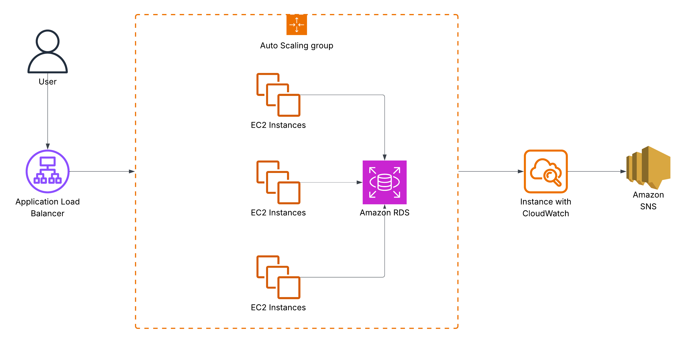

# Scalable Web Application on AWS

## Overview
This project demonstrates a scalable web application using EC2, Application Load Balancer (ALB), and Auto Scaling Group (ASG).

## Architecture
- EC2 instances host the web application
- ALB distributes traffic
- ASG automatically scales instances
- Optional: RDS database for backend

## Deployment
1. Deploy the CloudFormation template in `infrastructure/cloudformation.yml`
2. Upload your web app code to EC2 instances
3. Configure Auto Scaling policies and ALB listeners

## Monitoring & Alerts
- CloudWatch monitors instance metrics
- SNS sends alerts for scaling events

## Optional Demo
[Link to video demo or live deployment]
