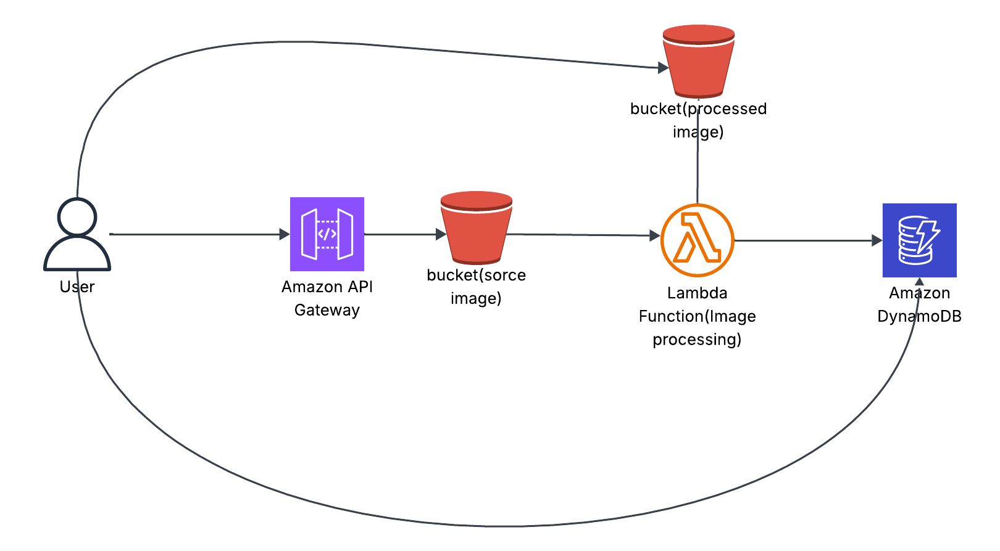

# Serverless Image Processing on AWS

## Overview
This project processes images uploaded to an S3 bucket using AWS Lambda. Processed images are stored in another bucket.

## Architecture
- **S3 Bucket (Input):** Upload images
- **Lambda Function:** Resizes/watermarks images
- **S3 Bucket (Output):** Stores processed images
- Optional: API Gateway for direct uploads

## Deployment
1. Deploy the CloudFormation template in `infrastructure/cloudformation.yml`
2. Upload Lambda function code
3. Configure S3 triggers for Lambda
4. Test by uploading images to the input bucket

## Optional Demo
[Link to video demo or live deployment]
